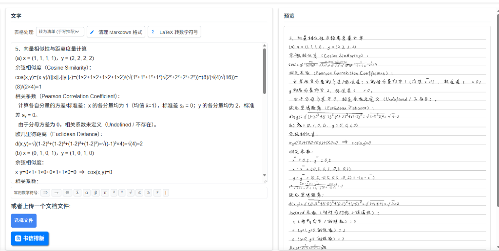

# Handwriting Web (Simon's Enhanced Edition)

> 老实写作业，很无聊吧

本分支为自用定制基准分支。基于原开源项目构建，针对理工科/作业抄写场景进行了深度排版增强，包括高可靠 Markdown 符号清洗、Word 公式兼容、字形 Fallback 引擎以及全自动手写上下竖式分式渲染。

📖 **[👉 点击查看原项目 README 文档 (Upstream README)](./README_upstream.md)**



---

## 🌟 自用分支增强特性 (Key Features)

### 1. 全场景手写上下竖式分式渲染 (Vertical Fraction Engine)
针对手写作业、实验报告及数学公式排版，彻底解决字体库倾斜分号（如 `½`）或斜杠（`1/2`）在手写纸面上突兀的问题：
- **键盘数值分式自动转换**：形如 `1/2`、`3/4`、`22/7`、`0.00005/1.1062` 等输入自动转换为工整的上下竖式分数。
- **代数复合公式与微商比值**：形如 `(a+b)/(c+d)`、`(\epsilon(x_1))/(|x_1|)`、`ds/s`、`dt/t` 自动解析为上下居中分数线排版。
- **递归复合繁分式支持**：分母中包含真分数或复合式（如 $\frac{gt \cdot dt}{\frac{1}{2}gt^2}$）时，自动采用黄金分割基线递归多层微分子排版，拒绝任何横向斜杠。

### 2. 手写根式上方横线封顶与括号消除 (Radical Vinculum Engine)
- 支持 `\sqrt{...}`、`\sqrt[n]{...}`、`√(...)`、`³√(8)`、`√x` 等各类数学根式；
- 按照人类真实书写习惯，根号顶部右侧精准延伸出水平封顶横线（vinculum），完全覆盖被开方表达式并自动消除多余外层括号；
- 完美支持根式与上下竖式分式互相多层嵌套（例如 $\sqrt{\frac{1}{2}}$ 与 $\frac{\sqrt{x+1}}{2}$）。

### 3. 真实数学字形 Fallback 引擎 (Glyph Fallback Engine)
- 原生手写中文字体通常缺失大量数学 Unicode 符号（如角标 $\text{x}_1, \text{x}_2$、上标 $\text{R}^3$、数学逻辑符号 $\Rightarrow, \in, \le, \ge, \to$ 等）。
- 引擎底层动态挂载备用高覆盖率开源字库，在主手写字体缺失字形时自动按同比例无缝绘制真实符号，**彻底消除方块问号或空白占位符**。

### 4. 高可靠两阶段 Markdown 清洗与格式转换 (Clean Markdown)
将用户粘贴的 Markdown/富文本作业内容清洗为适合手写纯文本排版：
- **精准区分星号语义**：严格遵循 CommonMark 规范定界符，消除斜体 `*italic*` 与粗体 `**bold**` 的同时，**绝不误伤算术乘号（如 `3 * 4 * 5 = 60`）和代数积**。
- **无序列表与短横线清洗**：智能剔除列表项前缀 `- `，同时完好保留负数与减法符号。
- **多模式表格排版**：支持将 Markdown 表格自动转为清单列表（`list`）或等宽无竖线对齐模式（`aligned`），贴合手写作业批注习惯。
- **分页符与结构保护**：保留手写分页标记 `---`，规范化任务列表与标题。

### 5. Word / WPS 复杂公式与特殊空白清洗
- 自动清理从 Word 题库或公式编辑器复制带来的零宽字符（`\u200b`）、窄空格（`\u202f`）与全角特殊空格，保证字符扰动引擎不会因隐形字符导致换行错乱。

---

## 🚀 快速启动与开发指南

### 本地前后端启动

```bash
# 1. 启动前端 SPA (开发代理端口 8080)
cd frontend
npm run serve

# 2. 启动 FastAPI 后端 (端口 5005)
# 必须使用项目根目录的 venv 虚拟环境
cd backend
../venv/Scripts/python.exe -m uvicorn app:app --reload --host 0.0.0.0 --port 5005
# Linux / macOS: ../venv/bin/python -m uvicorn app:app --reload --host 0.0.0.0 --port 5005
```

### 运行自用功能验证测试

```bash
# 验证前端 Markdown 增强清洗单元测试
cd frontend
npm run test:clean-markdown
```

---

## 📌 分支管理约定

- **`custom-base`（当前分支）**：自用主线与功能增强基准分支，包含自定义数学渲染与符号清洗增强。
- **`main`**：严格保持与上游官方仓库（[upstream/main](https://github.com/14790897/handwriting-web)）一致，仅用于拉取上游最新发布代码与功能同步，严禁直接在 `main` 上开发业务私有逻辑。
- **原项目文档**：若需查阅原项目历史说明、自部署 Docker 配置或视频介绍，请参阅 [README_upstream.md](./README_upstream.md)。
